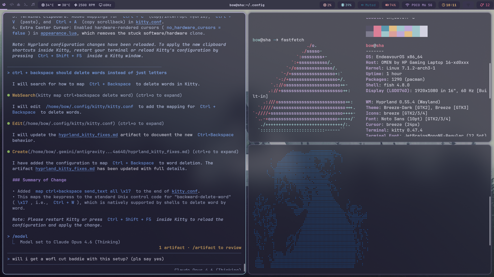

# Dotfiles Configuration

This repository contains the configuration files for a desktop environment based on Hyprland, Waybar, and other utilities.

<p align="center">
  
</p>

## Compatible Distributions
* Arch Linux
* EndeavourOS
* Other distributions running Hyprland 0.55+ (paths may require adjustment)

## System Dependencies
Ensure the following packages are installed before deploying:
* `hyprland` (0.55 or higher, Lua configuration support)
* `waybar`
* `swaync`
* `kitty`
* `waypaper`
* `awww`
* `mpd`
* `mpc`
* `brightnessctl`
* `hypridle`
* `hyprlock`
* `nvidia-utils` (if running Nvidia dGPU)

## Installation Instructions

1. **Backup Existing Configs**
   Back up any active configuration directories to prevent data loss:
   ```bash
   mkdir -p ~/backup_configs
   mv ~/.config/hypr ~/backup_configs/
   mv ~/.config/waybar ~/backup_configs/
   mv ~/.config/swaync ~/backup_configs/
   mv ~/.config/kitty ~/backup_configs/
   mv ~/.config/waypaper ~/backup_configs/
   ```

2. **Copy Configurations**
   Copy the contents of this repository directly into the `~/.config` directory:
   ```bash
   cp -r ./* ~/.config/
   ```

3. **Configure Fan Permissions (HP Laptops)**
   To enable fan speed adjustments without password elevation, run the setup script:
   ```bash
   sudo ~/setup_fan_rules.sh
   ```

4. **Reload Configurations**
   Reload the compositor to apply all configuration changes:
   ```bash
   hyprctl reload
   ```

## Potential Conflicts
* **Wallpaper Daemons**: `hyprpaper` or `swww` running concurrently with `awww` will cause background rendering conflicts.
* **Input Settings Managers**: Desktop environment services (e.g., KDE/GNOME settings daemons) may attempt to override mouse and touchpad natural scrolling parameters on startup. The autostart configuration employs a startup delay to mitigate this.

## Disclaimer
idk dude works on my machine
